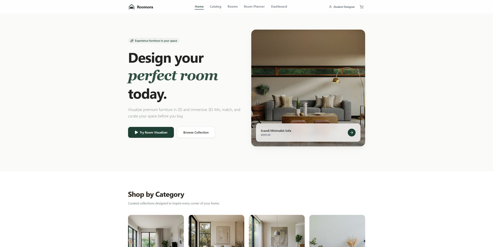
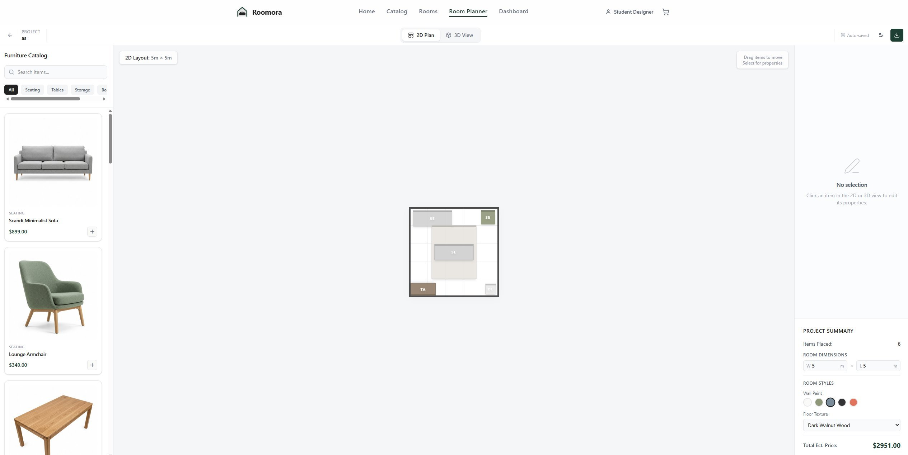
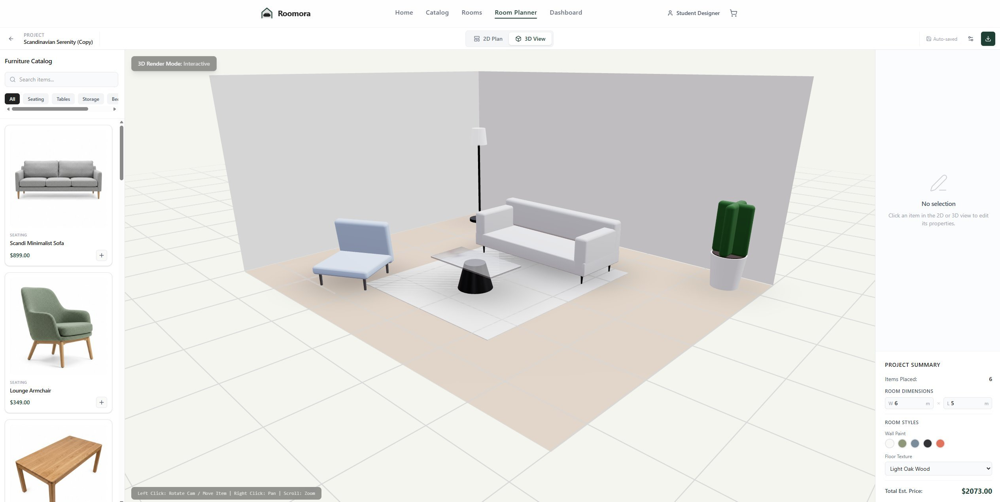
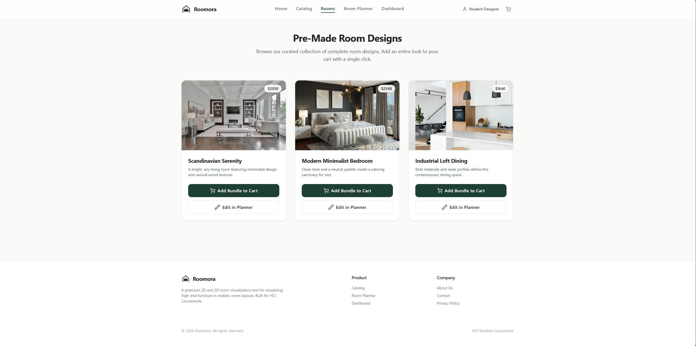
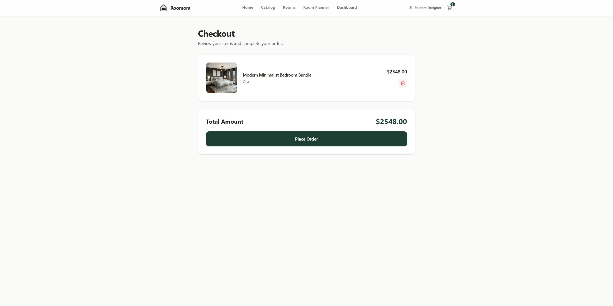

# 🛋️ Roomora
**Plan in 2D. Experience in 3D.**

Roomora is a premium, interactive room planning and furniture visualization application. It allows users to design floor layouts on a 2D canvas and instantly switch to an immersive, real-time 3D environment to experience their spatial designs.

🌐 **Live Project:** [roomora.vercel.app](https://roomora-kappa.vercel.app/)

---

## 📖 Academic Context & HCI Design
This project was developed for a **Human-Computer Interaction (HCI) & Computer Graphics** module. The development followed a systematic user-centered design approach:

- **HCI Principles:** We focused on **Visibility of system status** (real-time rendering), **Consistency** (standardized UI patterns), and **Error prevention** (drag-and-drop constraints).
- **Usability Focus:** The interface is designed to reduce cognitive load, allowing novice users to create complex spatial designs without CAD experience.
- **Computer Graphics:** Utilizes **React Three Fiber (R3F)** for high-performance WebGL rendering, implementing procedural mesh generation and real-time lighting.

---

## ✨ Core Features
| Feature | Technical Implementation |
|---|---|
| **Intelligent 2D Editor** | Scaled grid system with snap-to-grid furniture placement. |
| **Instant 3D Transition** | Seamless state synchronization between 2D coordinates and 3D space. |
| **Smart Wall Culling** | Interactive wall transparency (backface culling) for better visibility. |
| **Interactive 3D Manipulation**| Direct object dragging and repositioning within the 3D environment using TransformControls. |
| **Dynamic Catalog** | Multi-category furniture browse system with real-time state management. |
| **Pre-Made Room Designs** | Curated catalog of room templates with one-click cloning into the planner. |
| **Mock Checkout Flow**    | Shopping cart functionality to aggregate items and simulate a purchase. |
| **Responsive Design** | Fluid layouts optimized for both desktop and mobile viewports. |

---

## 🔧 Technical Stack
- **Framework:** [React 19](https://react.dev/) + [TypeScript](https://www.typescriptlang.org/)
- **Build Engine:** [Vite 6](https://vitejs.dev/)
- **3D Engine:** [Three.js](https://threejs.org/) via [React Three Fiber](https://r3f.docs.pmndrs.ch/)
- **Styling:** [Tailwind CSS v4](https://tailwindcss.com/)
- **State Management:** [Zustand](https://github.com/pmndrs/zustand)
- **Icons:** [Lucide React](https://lucide.dev/)

---

## 🚀 Installation & Development
1. **Clone the repository:**
   ```bash
   git clone https://github.com/wathsara02/Roomora.git
   cd Roomora
   ```
2. **Install dependencies:**
   ```bash
   npm install
   ```
3. **Launch development server:**
   ```bash
   npm run dev
   ```
4. **Build for production:**
   ```bash
   npm run build
   ```

---

## 📁 Project Architecture
```text
src/
├── components/
│   ├── layout/         # Navigation, Global Shell, Footer
│   └── planner/        # 2D Canvas, 3D Scene, Toolbar, Properties
│       └── furniture/  # Procedural 3D Model logic
├── pages/              # Route-level views (Home, Catalog, Visualizer)
├── store/              # Zustand Store for central state (useStore.ts)
├── types/              # Domain-specific TypeScript interfaces
└── lib/                # Geometry utilities and math helpers
```

---

## 📜 Credits & Acknowledgments
We would like to acknowledge the creators of the following open-source resources used in this project:

- **Graphics:** [Drei](https://github.com/pmndrs/drei) for advanced Three.js abstractions.
- **Imagery:** [Unsplash](https://unsplash.com/) for professional interior design photography and textures.
- **Tools:** [Lucide](https://lucide.dev/) for the consistent iconography system.
- **Typography:** Inter and Outfit via [Google Fonts](https://fonts.google.com/).

---

## 👥 Contributors
- [@ShehanPerera](https://github.com/ShehanPerera319) Project Initialization & Landing Page
- [@DidulakaHirusha](https://github.com/DidulakaHirusha) : Requirements & Catalog
- [@Sasindu26](https://github.com/sasindu26)  : UI/UX Design & Dashboard
- [@Sulakshi20](https://github.com/Sulakshi20): 2D Editor Logic
- [@ShanushkiBoshinayaka](https://github.com/ShanushkiBodhinayaka): 3D Graphics, Rendering, & **Interactive 3D Object Manipulation**
- [@wathsara02](https://github.com/wathsara02) : Project Lead, User Testing, State Management & Pre-Made Room Template Cloning into 3D Space

---

## 📸 Project Screenshots
| Landing Page | 2D Planner | 3D Visualizer | Pre-Made Rooms | Checkout |
|---|---|---|---|---|
|  |  |  |  |  |

---
*© 2026 Roomora Team - HCI & Computer Graphics Coursework.*
